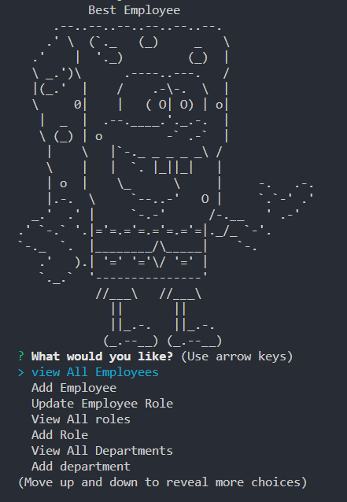

# 👷‍♀️👷‍♂️ Staff-Trainning-program

## Description

This is a description of a command-line application that allows users to interact with a database of departments, roles, and employees. When the user starts the application, they are presented with several options, including the ability to view all departments, roles, and employees, as well as add new departments, roles, and employees, and update an employee's role.

## Technologies used:

1. Node.js
2. SQL2
3. dotenv
4. JavaScript
5. Inqurier
6. console.table

## Installation:

1. Install Node.js
2. Open a terminal in vs code and navigate to the root directory of your project.
3. Run the following commands, npm init -y.
4. npm install sql2
5. npm install console.table
6. npm install inqurier@6.3.1

## tests

No tests where taken at this time

## Usage:

1. Make sure you have Node.js and MySQL installed on your machine.
2. Create a new database in MySQL by running the code in the schema.sql file in your MySQL client.
3. Populate the database with my sample or your own data by running the code in the insert.sql file in your MySQL client.
4. Create a .env file in the root of the project folder and add the following variables to it, replacing the values with your own MySQL username and password:
5. Run npm install in the project directory to install the necessary dependencies.
6. Start the app by running npm start.
7. You will be presented with a list of options for managing employee information. Select the option you want by using the arrow keys and pressing enter.
8. Depending on the option you select, you may be prompted to enter additional information example
   add employee, add deparment, update employee, delete employee so on.
9. After completing the action, you will be taken back to the main menu to select another option or quit the quit option will give you a count down timer 3 - 1 that will after exit the application.

# Video

## Contact-Details

1. linkedin: ://www.linkedin.com/in/kayhan-mamak-5423b4262/
2. Github: https://github.com/byunn90
3. Email: Kayhan_mamak@hotmail.com
